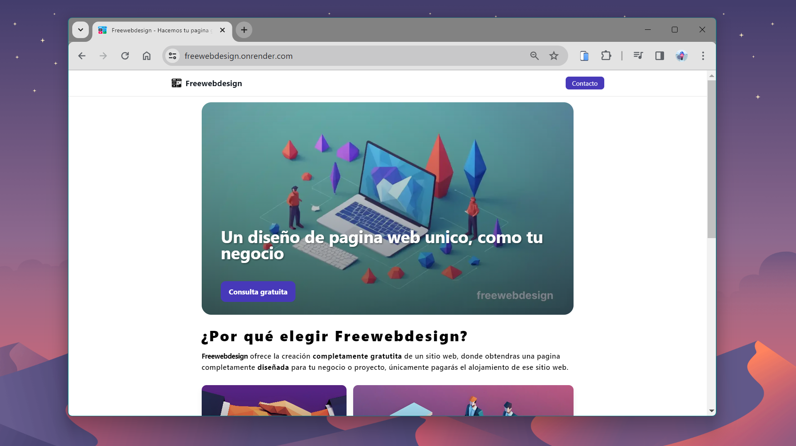

 
        
<h2>
    <em>Landing</em> para Freewebdesign
</h2>
</a>

  <em>
    Estilo sencillo y <strong>elegante</strong>
  </em>

  <em>
    Con el maximo rendimiento y <strong>SEO</strong>
  </em>

    &nbsp;✦&nbsp;
    <a href="#licencia">
        Licencia
    </a>
    &nbsp;✦&nbsp;
    <a href="https://portfolio-tonidev.netlify.app/">
        Personal
    </a>

    
    

## 🛠️ Stack

- [**Astro**](https://astro.build/) - Framework principal para generar pagina estatica.
- [**Typescript**](https://www.typescriptlang.org/) y [**Tailwind**](https://www.typescriptlang.org/)  - Aceleradores de desarollo.

## 🔑 Licencia

[MIT](LICENSE.txt) - Creado por [**tonidev**](https://github.com/EseToni/)).

## 🫂 Contribuidores

  <a href="https://github.com/EseToni/Portfolio-Template/graphs/contributors">
    
  <a/>
